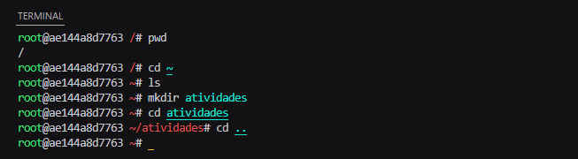
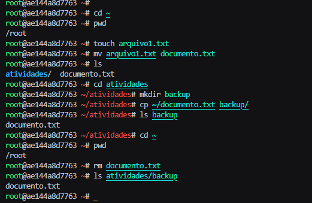
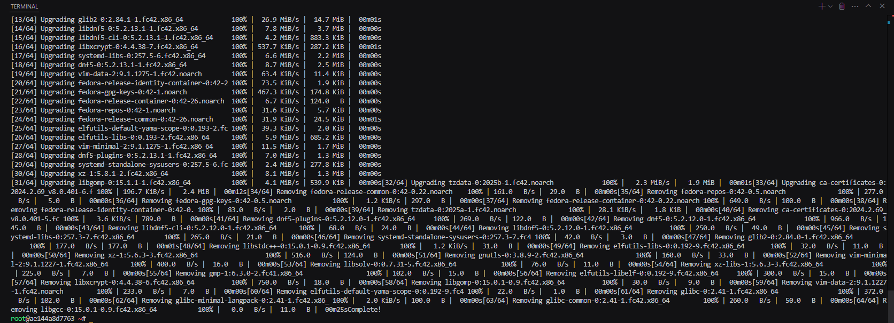
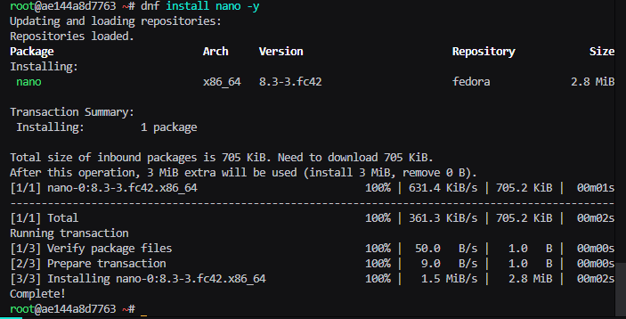
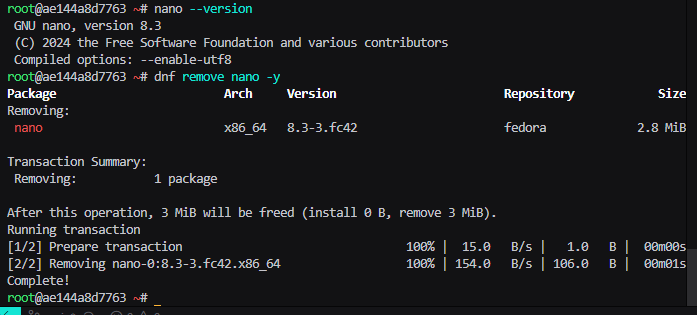
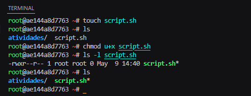
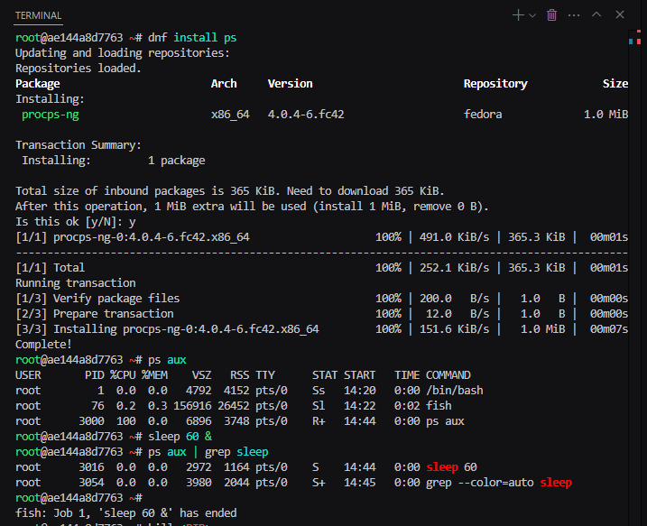
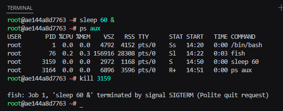
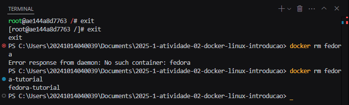

# Relatório de Atividade Prática com Linux no Docker

## Informações Gerais
- **Título:** Atividade 02 - Introdução a Linux usando Docker no Windows
- **Nome:** Gustavo José Teixeira Tavares
- **Data:** 05/06/2025

## Introdução

Este relatório documenta a realização da atividade prática de introdução ao Linux utilizando um contêiner Docker baseado no Fedora. O objetivo foi aplicar conceitos básicos do sistema operacional Linux, executando comandos para navegação no sistema de arquivos, manipulação de arquivos, gerenciamento de pacotes, permissões e processos.

## Relato das Atividades

### Navegação no sistema de arquivos

Após a criação do container docker usando a imagem fedora. Ao iniciar o container é possivel observar um novo terminal que é referente ao da imagem carregada no container, e como a imagem é linux o modo de navegar pelos diretórios é como os demais terminais linux. Após navegar para o diretório home `~` crio um novo diretório `atividades` usando o comando `mkdir`.

### Manipulação de arquivos

Depois de conhecer como a navegação funciona farei a manipulação de arqivos. A principio busco chegar ao diretório `~`, que é o diretório home do usuário, ao acessar o diretório executo o comando `pwd` para que me seja mostrado o caminho do diretório em que estou atualmente. Após a verificação crio o arquivo `arquivo1.txt` e logo o renomeio para `documento.txt` usando o comando `mv`, após renomear o arquivo faço uma cópia dele e a armazeno no diretório `backup` que acaba de ser criado. Após fazer a cópia apago o arquivo original que está no diretório `~` usando o comando `rm` e checo se sua cópia ainda está no backup.

### Atualização de pacotes

Nesta etapa executo o comando `dnf update` para atualizar a lista de pacotes e prosseguir nas seguintes etapas.

### gerenciamento de pacotes

Após a atualização dos pacotes instalo o editor de texto `nano` com a extensão `-y` no comando de execução para autorizar todas as permissões necessárias para a instalação. Após a instalação verifico a versão instalada e logo após o desinstalo com o comando `remove` com a mesam extensão usada na instalação para autorizar as permissões.

### Permissões

Nessa etapa crio um arquivo `script.sh` e usando o comando `chmod` dou permissão ao usuário `u` para que ele execute `+x` o arquivo `script.sh`.

### Processos

Nessa etapa é usado o pacote `ps`, para isso, instalo o pacote da maneira tradicional. Após a instalação executo o comando `ps aux` para que me sejam mostrados todos processos em execução no momento, sabendo como visualizar os processos executo o comando `sleep 60 &` para executar uma contagem de 60 segundo em segundo plano, mas, antes da contagem terminar verifico seu código PID e executo o comando `kill <PID>` para interromper o processo de contagem.

### Saindo do container

para finalizar a sequência de execuções uso o comando `exit` para sair do conatainer docker, na imagem executo o comando duas vezes, uma para sair do terminal fish que usei durante a execção e a segunda para sair definitivamente do container. Após sair do container o removo usando o comando `rm`.

## Conclusão

### O que aprendi?

Já tinha usado linux antes, mas as aplicações executadas na tividade relembraram alguns comando e me ensinaram novos comandos e como usar melhor o terminal linux e me mostrou como o linux é customizável, podendo instalar diferentes pacotes de maneira simples.

### Dificuldades

Com o passo a passo ao lado não tive dificuldade de execução, mas alguns comandos pesquisei como que eles funcionavam porque nem sempre o passo a passo dizia suas funções ao fundo.